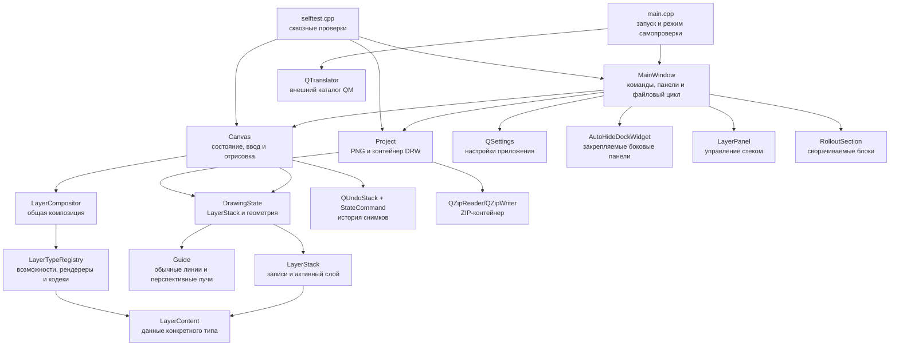

# Архитектура «Технический рисунок / Technical Draw»

## 1. Назначение и границы

Приложение — однодокументный растровый редактор на C++17 и Qt Widgets. Оно объединяет обычное рисование с неразрушающей оснасткой перспективы: горизонт, главная вертикаль, точки схода, семейства опорных линий, линейки и экранные маркеры не записываются в пиксели изображения.

Модель документа рассчитана на упорядоченный стек разных типов слоёв. Пользовательские команды и панель управляют несколькими растровыми слоями; общий контракт допускает последующую регистрацию других типов без изменений `Canvas` и компоновщика. Камеры, трёхмерной сцены и физических параметров объектива в модели нет. Перспектива задаётся только геометрическими объектами на плоскости холста.

## 2. Компоненты

### `main.cpp`

Точка входа задаёт DPI-режим, технические идентификаторы приложения, шрифт, значок и мигрирует прежние настройки `DrawingPrototype/Drawing`. До создания окна она загружает через `QTranslator` внешний каталог из подкаталога `translations`: сначала для полной системной локали, затем для языка и, наконец, русский каталог по умолчанию. Обычный запуск создаёт `MainWindow`; параметр `--self-test <каталог>` передаёт управление встроенным проверкам без входа в основной цикл редактора. После показа окна `taskbarpin.cpp` проверяет одноразовый флаг установщика и через стабильный WinRT ABI вызывает системный `TaskbarManager`. Флаг снимается до вызова, поэтому отказ пользователя, политика или отсутствие API не создают повторных запросов.

### `MainWindow`

Главное окно отвечает за пользовательские команды и компоновку:

- создаёт меню, панели инструментов, строку состояния, dock-панели перспективы и слоёв;
- размещает единое действие вспомогательного режима перспективы в главной верхней панели и меню, а в боковой панели оставляет рисующие инструменты и панорамирование;
- связывает элементы управления с методами `Canvas`;
- ведёт текущий путь документа, недавние файлы и каталоги открытия/сохранения;
- выполняет цикл «проверить несохранённые изменения → открыть/создать/закрыть»;
- вызывает `Project` для чтения, сохранения и экспорта;
- хранит настройки интерфейса и отображения в `QSettings`.

`MainWindow` не строит геометрию перспективы и не изменяет пиксели напрямую. Его поля элементов управления являются отражением текущего `DrawingState`; метод `updateState()` синхронизирует интерфейс после изменения модели или истории.

Меню `Изображение → Направляющие` создаёт обычные направляющие в точной позиции от верхнего или левого края и включает жест создания перспективной направляющей. Позиция обычной направляющей вводится в пикселях либо процентах полного соответствующего размера холста. Команды прилипания и перспективного жеста в меню и главном тулбаре используют общие `QAction`, поэтому состояния не могут разойтись между представлениями.

### `AutoHideDockWidget`

Панель инструментов слева и панели перспективы и слоёв справа используют один компонент. В закреплённом состоянии он держит содержимое в `QDockWidget` и занимает место в компоновке главного окна; две правые панели делят колонку по вертикали. Минимальная ширина задаётся при создании панели: 250 px для инструментов и 330 px для правой колонки; расширение обеих сторон остаётся свободным, а содержимое перспективы не показывает горизонтальную полосу прокрутки. На внутренней границе каждой закреплённой панели находится явная область захвата: она показывает курсор горизонтального изменения размера и через `QMainWindow::resizeDocks()` изменяет ширину вправо для левой стороны и влево для правой. Жест использует экранную координату указателя, поэтому перемещение самой границы при перестройке layout не создаёт обратную связь и рывки. Пин расположен у внутренней стороны заголовка: справа у левой панели и слева у правых.

После снятия пина компонент переносит ту же рамку с теми же экземплярами элементов управления во временный слой и скрывает основную dock-область. Все откреплённые панели одной стороны используют общую вертикальную `QToolBar` у внешнего края окна. Полоса не участвует в делении dock-панелей, оставляет несколько пикселей до ближайшей линейки и располагает кнопки без промежутков в устойчивом порядке; справа первой идёт «Перспектива», следом «Слои». Нажатие вкладки раскрывает панель от верхней границы рабочей области поверх центрального виджета и закреплённых панелей той же стороны, не меняя размеры холста и dock-компоновку. Временная панель возвращается в общую компоновку только после нажатия пина; глобальный фильтр событий скрывает её после щелчка снаружи. Команда меню «Вид» независимо отключает панель и её вкладку. Кнопка в правом нижнем углу переводит все видимые панели в крайние вкладки и после перестройки компоновки вписывает холст в освободившееся пространство. Положение пина, видимость и последняя ширина хранятся отдельно для каждой панели.

### `DrawingToolSettingsModel` и `ToolPropertiesPanel`

`DrawingToolSettingsModel` хранит независимые параметры карандаша, кисти и ластика в `QSettings`: ширину, непрозрачность, жёсткость, шаг отпечатков и силу. Активный инструмент выбирает один из трёх наборов, поэтому единая панель не создаёт дублирующих состояний. Прежние ключи ширины продолжают читаться и обновляться для совместимости.

`ToolPropertiesPanel` находится внутри левой панели инструментов под кнопками выбора. Для карандаша, кисти и ластика часто используемые параметры и дополнительные свойства наконечника разнесены по двум сворачиваемым секциям. Универсальный инструмент «Перемещение» показывает вместо них явную цель: «Направляющие» либо «Выбранный слой». Панель получает только модель настроек и `DrawingTargetContext`; она не обращается к растровым данным. `MainWindow` формирует контекст из возможностей, видимости, блокировки и состояния прозрачности активного слоя. Панель отключает рисование с понятной причиной для несовместимого, скрытого или заблокированного слоя; ластик показывает фактический результат «До прозрачности» или «Цветом Back».

### `LayerPanel`

Панель находится справа под панелью перспективы и использует собственный `AutoHideDockWidget`. Список отображает слои сверху вниз в порядке, обратном внутреннему порядку композиции. Строка без внешнего отступа содержит миниатюру зарегистрированного рендерера, статическое имя, выровненный вправо уменьшенный тип, глаз и замок; двойной щелчок по имени временно открывает поле переименования. Общие команды создают, удаляют, дублируют и переставляют слои; свойства активной записи управляют непрозрачностью, числовым смещением X/Y, доступностью и фиксацией альфа-канала. Все документные изменения делегируются `Canvas` и становятся командами Undo/Redo.

### `Canvas`

`Canvas` — центральный интерактивный виджет и владелец активного `DrawingState`. Он:

- рисует композицию документных слоёв, оснастку перспективы, маркеры и четыре линейки;
- преобразует координаты изображения и окна;
- обрабатывает мышь, клавиши, масштаб и панорамирование;
- создаёт обычные направляющие жестом с любой из четырёх линеек, показывает живой предпросмотр и принимает объект только при отпускании внутри документа;
- универсальным инструментом перемещает обычные направляющие, их пересечение либо активный слой; направляющая удаляется при отпускании за документом, а `Esc` возвращает состояние до жеста;
- создаёт перспективный луч из исходной точки жеста, один раз выбирает точку схода по угловому порогу и затем хранит только идентификатор точки и направление луча;
- выполняет карандаш, кисть, ластик и связанные отрезки;
- выбирает, перемещает, фиксирует и привязывает точки и оси;
- применяет симметрию пар точек;
- хранит `QUndoStack` и формирует `DrawingHistory` для сохранения.

Изменение документа, которое должно участвовать в Undo/Redo, начинается с копии `DrawingState before` и завершается `commit()`. Содержимое слоёв разделяется между снимками и отделяется при первой записи активного слоя. Изменения только внешнего вида оснастки обновляют состояние и виджет, но не обязаны попадать в проектную историю.

Растровый штрих строится одинаковым конвейером для трёх инструментов: `Canvas` интерполирует траекторию и через заданный процент диаметра накладывает круглый отпечаток на активный совместимый слой. Остаток расстояния переносится между соседними событиями мыши, поэтому быстрый ввод не создаёт разрывов и не зависит от частоты событий. При включённом общем режиме прилипания начало штриха захватывает ближайшую направляющую в заданном экранном радиусе и удерживает её устойчивый идентификатор до завершения жеста. Каждое следующее положение указателя проецируется через `GuideGeometry`; односторонняя проекция перспективного луча не пропускает штрих за точку схода. Наведение заранее подсвечивает траекторию, а отключённый режим оставляет свободный штрих и угловое ограничение `Ctrl+Shift`. Карандаш использует жёсткий круг, кисть — круг с радиальным переходом жёсткости. Ластик уменьшает альфа-канал слоя с доступной незаблокированной прозрачностью; иначе наносит цвет Back. Один завершённый жест создаёт одну команду Undo.

### `StateCommand`

Закрытый класс в `canvas.cpp` реализует одну команду `QUndoCommand`. Он хранит состояния до и после операции и вызывает `Canvas::apply()` при отмене и повторе. Такая модель проста и надёжна для текущего ограничения размера холста; число снимков ограничивается по ориентировочному бюджету памяти и верхнему пределу истории.

### Слойная модель

`layermodel.h` определяет расширяемую часть документа. `LayerEntry` хранит общие свойства слоя и разделяемую ссылку на `LayerContent`; конкретное содержимое не зависит от виджетов. `LayerStack` задаёт порядок снизу вверх, активный слой и copy-on-write-доступ для инструментов.

`LayerTypeRegistry` связывает устойчивый строковый тип с фабрикой, набором возможностей, неизменяющим `LayerRenderer`, `LayerCodec` и необязательным растровым доступом. Общий код не выбирает тип слоя через `switch`. Встроенный `RasterLayerContent` хранит `QImage`, доступность прозрачности и её фиксацию.

`LayerCompositor` проходит видимые записи снизу вверх и применяет рендерер зарегистрированного типа. Один проход используется для экрана, итогового изображения и миниатюры; `LayerRenderContext` передаёт преобразование координат, отсечение, масштаб, DPI и режим качества. Перспектива и маркеры рисуются после документных слоёв отдельным служебным проходом.

### Модель проекта

`guidemodel.h` определяет служебные объекты направляющих независимо от виджетов и растровых слоёв. `Guide` хранит устойчивый идентификатор и один из трёх типов геометрии: положение горизонтали, положение вертикали либо направление одностороннего луча со ссылкой на точку схода. `GuideGeometry::project()` и `nearest()` предоставляют единый результат с ближайшей точкой, касательным направлением и расстоянием; перспективная проекция ограничена началом луча и не переходит на противоположную полупрямую. Этот контракт позволяет рисующим инструментам и будущей криволинейной реализации не ветвиться по типу направляющей.

`project.h` определяет основные типы состояния:

- `VanishingPoint` — устойчивый идентификатор, имя, координаты, набор привязок, фиксация и текущие параметры отображения точки;
- `DrawingState` — размер холста, `LayerStack`, коллекции точек и направляющих, положение и фиксация осей, а также параметры отображения оснастки;
- `DrawingHistory` — последовательность состояний, подписи переходов и текущая позиция Undo/Redo.

Пространство имён `PerspectiveTarget` централизует служебные идентификаторы привязок. Пространство имён `Project` задаёт версию формата и операции PNG/DRW.

### `Project`

`project.cpp` — единственная подсистема, знающая устройство `.drw`. Она проверяет размеры и ограничения, преобразует геометрию перспективы, направляющие и общие свойства слоёв в JSON, а содержимое передаёт кодеку зарегистрированного типа. Ресурсы истории дедуплицируются по SHA-256. Загрузчик читает прежние версии как один растровый слой и отклоняет неизвестный тип без сведения в растр. Файл атомарно заменяется через `QSaveFile`. Обычный экспорт поддерживает PNG, JPEG и BMP. Для JPEG и BMP композиция предварительно сводится на белый фон, поскольку эти варианты не сохраняют прозрачность; PNG сохраняет альфа-канал. Направляющие не входят в `flattenedImage()` и поэтому не попадают ни в один экспортируемый растр.

ZIP реализован закрытыми классами Qt `QZipReader` и `QZipWriter`. Из-за этого бинарник привязан к точной сборке Qt 5.15.2; при обновлении Qt требуется отдельная проверка или замена ZIP-слоя публичной библиотекой.

### `RolloutSection`

Небольшой составной виджет формирует рамку, заголовок с треугольной кнопкой и скрываемую область содержимого. Он не знает о перспективе и может повторно использоваться для других сворачиваемых блоков интерфейса.

### `selftest.cpp`

Встроенный сквозной тест запускает настоящие `Canvas` и `MainWindow`, имитирует ввод, проверяет состояния, настройки и файлы, а также сохраняет эталонные снимки. Для проверки расширяемости слоёв он временно регистрирует нерастровый тестовый тип с собственной фабрикой, рендерером и кодеком, затем проверяет композицию, миниатюру и цикл сохранения/загрузки через общий конвейер. При обычном запуске приложения этот тип не регистрируется. Режим `offscreen` не проверяет системные диалоги; режим `windows` дополняет его оконными сценариями.

## 3. Поток изменения данных

Обычное действие проходит следующий путь:

1. `QAction`, элемент панели либо событие мыши получает пользовательский ввод.
2. `MainWindow` вызывает публичный метод `Canvas`, либо `Canvas` обрабатывает событие непосредственно.
3. `Canvas` проверяет ограничения, изменяет `DrawingState` и при документной операции добавляет `StateCommand` в `QUndoStack`.
4. `Canvas` испускает `stateChanged()`, `viewChanged()`, `positionChanged()` или `selectedPointChanged()`.
5. `MainWindow` обновляет доступность команд, значения контролов, заголовок и строку состояния.
6. `Canvas::paintEvent()` передаёт стек общему компоновщику, затем строит служебную оснастку.

При сохранении `MainWindow` получает `Canvas::history()` и передаёт её `Project::save()`. После успешной атомарной записи чистая позиция `QUndoStack` соответствует сохранённому состоянию. При открытии `Project::load()` возвращает историю, а `Canvas::setDocument()` восстанавливает команды и индекс.

## 4. Системы координат

### Координаты изображения

В координатах документа начало находится в левом верхнем углу холста, X растёт вправо, Y — вниз. Растровое содержимое использует те же пиксельные координаты с учётом смещения своей записи. Положения точек и осей в `DrawingState` могут лежать за границами холста.

### Пользовательские координаты

Числовые поля показывают значения относительно центра холста: X растёт вправо, Y — вверх. В процентном режиме `100%` равно полной ширине или высоте, поэтому правый верхний угол имеет `(50%, 50%)`. Единицы выбранной точки/оси не связаны с единицами линеек.

### Координаты виджета

`toView()` переносит точку изображения относительно его центра, умножает на `zoom_`, затем добавляет центр доступного viewport и `pan_`. `toImage()` выполняет обратное преобразование. Толщины маркеров, зоны попадания, отступ луча и длина нарастания прозрачности задаются в экранных пикселях и не меняются при масштабе.

Панорамирование средней кнопкой мыши либо с временно нажатым пробелом изменяет только `pan_` при любом выбранном инструменте; масштаб изменяет `zoom_` вокруг заданной экранной опорной точки. Ни одна из этих операций не меняет слой или проектную геометрию.

Положение курсора показывается двумя штриховыми проекциями через всю область просмотра и все четыре линейки. Отдельные числовые плашки на линейках не строятся; координаты остаются в строке состояния и используют выбранные для линеек единицы. Горизонтальные и вертикальные направляющие хранят координату документа, но рисуются через всю доступную область между линейками. Их временная видимость и текущий выбор принадлежат состоянию представления, поэтому не создают команду истории и не сохраняются в `.drw`.

## 5. Геометрия перспективы

Горизонт всегда задаётся одним `horizonY`, главная вертикаль — одним `verticalX`; наклона у осей нет. Точка может быть свободной, привязанной к одной оси или одновременно к обеим. Привязка хранится массивом устойчивых идентификаторов, а не номером точки.

При перетаскивании зона прилипания равна 10 экранным пикселям. В пересечении осей обе привязки могут действовать одновременно. Перемещение оси переносит соответствующую координату всех привязанных точек. Фиксация запрещает перетаскивание объекта мышью.

Симметрия горизонта связывает точки, прикреплённые только к горизонту, относительно главной вертикали. Симметрия главной вертикали аналогично связывает точки на вертикали относительно горизонта. Партнёр выбирается в начале перетаскивания как ближайшая точка к зеркальной позиции и сохраняется до отпускания кнопки.

Каждая видимая точка формирует собственный веер прямых. Угловой шаг ограничен диапазоном 1–30°. Рисуются только лучи, пересекающие холст: участок начинается после экранного отступа от точки и заканчивается после дальней границы изображения. Горизонт и главная вертикаль продолжаются через viewport.

## 6. Формат `.drw`

`.drw` — ZIP-контейнер. Текущая версия схемы — 10.

| Элемент | Назначение |
|---|---|
| `project.json` | Версия, размеры, геометрия перспективы и направляющих, текущий стек, манифесты состояний истории, подписи и индекс истории. |
| `drawing.png` | Сведённая текущая композиция для предпросмотра и совместимости контейнера. |
| `resources/<sha256>.<ext>` | Неизменяемые ресурсы содержимого слоёв; одинаковые данные разных состояний хранятся один раз. |

Для каждого слоя сохраняются идентификатор, тип, имя, порядок, видимость, блокировка, непрозрачность, смещение и манифест кодека; растровый кодек хранит PNG и состояние альфа-канала. Также сохраняются координаты, идентификаторы, названия, привязки и фиксация точек, положение и фиксация осей. Направляющая сохраняет устойчивый идентификатор, тип и соответствующую геометрию; перспективный луч дополнительно хранит ссылку на точку схода. Цвета и другие параметры отображения перспективы и направляющих берутся из настроек приложения и при чтении проекта не восстанавливаются.

Загрузчик принимает версии 1–10. Версии 1–8 разворачиваются в один растровый слой, версия 9 восстанавливает стек через реестр кодеков, версия 10 добавляет направляющие во все снимки истории. При чтении версий 1–9 создаётся пустой набор направляющих. Неизвестная будущая версия, тип слоя или направляющей отклоняется. Ограничения входа защищают от чрезмерных размеров изображения, числа слоёв и направляющих, распакованного архива, JSON и истории.

## 7. Настройки приложения

`QSettings` использует технические идентификаторы организации и приложения `TechDraw`. Основные группы:

- `files/*` — раздельные каталоги открытия/сохранения и пять недавних файлов;
- `canvas/*` — последний размер нового холста;
- `tools/*` — отдельная ширина карандаша, кисти и ластика;
- `view/rulers/*` — единицы линеек;
- `view/guides/*` — независимые состояния показа и общего режима прилипания, экранное расстояние захвата, а также угловой порог выбора точки схода для перспективной направляющей;
- `workspace/tools/*`, `workspace/perspective/*`, `workspace/layers/*` — видимость, закрепление и последняя ширина боковых панелей;
- `perspective/common/*` — сохранённый набор параметров лучей;
- `perspective/view/*` — цвета, толщины, видимость, симметрия и прочее оформление;
- `perspective/points/*` — значения отображения точек по порядку.
- `installer/pendingTaskbarPin` — одноразовое намерение запросить системное закрепление на панели задач.

Настройки интерфейса не являются частью `.drw`. При первом запуске с пустыми текущими настройками выполняется одноразовое копирование прежней группы `DrawingPrototype/Drawing`.

## 8. Сборка и поставка

Корневой `CMakeLists.txt` создаёт одну цель `TechDraw`, включает C++17, AUTOMOC/AUTORCC, Qt Widgets, Qt LinguistTools и закрытую цель Qt Gui. `qt5_add_translation` собирает `translations/techdraw_ru.ts` в `.qm`, а команда после сборки помещает каталог в `translations` рядом с EXE. Для MinGW Windows-ресурс компилируется отдельной командой, чтобы `windres` работал с путями, содержащими пробелы.

Сценарии `scripts/windows` составляют поддерживаемый интерфейс сборки. x64 и x86 используют отдельные комплекты Qt/MinGW, каталоги CMake, переносимые пакеты `dist/TechDraw` и `dist/TechDraw-x86`, результаты проверок и установщики с суффиксом архитектуры. Перед упаковкой PE-заголовки всех EXE/DLL проверяются на единую разрядность.

Каталог `installer` хранит исходные шаблоны Qt Installer Framework: общую конфигурацию, метаданные единственного обязательного компонента, управляющий сценарий, сценарий операций и `.ui`-страницы. Идентификаторы продукта находятся в `installer/product.json`, а версия читается из `CMakeLists.txt`. `prepare-ifw-package.ps1` объединяет эти данные с соответствующим переносимым комплектом в игнорируемом дереве `build/installer-*/ifw`; `binarycreator --offline-only` превращает его в один автономный EXE.

Компонент добавляет операции ярлыков, ассоциации `.drw`, служебного состояния установки и одноразового намерения закрепления на панели задач. Видимую запись Windows «Приложения и возможности» создаёт и удаляет сам QtIFW; компонент не дублирует её. Версия, каталог, язык, архитектура и технология записываются в отдельный ключ `Software\TechDraw\Installer`, а прежний ключ IExpress в разделе `Uninstall` читается только как источник совместимости при миграции. QtIFW журналирует извлечение и сопутствующие операции для отката и удаления; `RemoveTargetDir=false` не позволяет деинсталлятору удалить постороннее содержимое выбранного каталога. При замене прежней IExpress-версии ограниченный `migrate-legacy.ps1` читает только её закрытый манифест владения и не затрагивает пользовательские документы. Перед удалением прежних файлов, ярлыков, ассоциации и записи удаления он сохраняет их во временном каталоге. Операция `Execute` содержит парную команду `UNDOEXECUTE`, которая восстанавливает сохранённое при откате QtIFW; после успешной установки режим `Commit` удаляет резервную копию. Области CurrentUser и AllUsers имеют раздельные каталоги, ярлыки и ветви реестра. Заглушки подписи вызываются после развёртывания бинарных файлов и после создания итогового QtIFW EXE. Подробные команды находятся в [howto.md](howto.md).

## 9. Точки расширения

### Новый рисующий инструмент

Добавьте значение в `Canvas::Tool`, действие меню/панели в `MainWindow`, обработку штриха в `Canvas` и сквозную проверку. Если инструмент имеет собственные постоянные параметры, храните их отдельно в `QSettings`. Пиксельные изменения должны проходить через `commit()`.

### Новый тип перспективы

Расширяйте геометрию модели независимо от `MainWindow`: новые устойчивые данные добавляются в `DrawingState`, их ввод и отрисовка — в `Canvas`, элементы управления — в панели окна. Изменение сохраняемого формата требует увеличить `Project::CurrentFormatVersion`, добавить обратное чтение и тесты старых версий.

Криволинейные направляющие должны появиться раньше инструментов рисования вдоль них. Внешний вид направляющих остаётся служебным оверлеем, пока пользователь явно не создаёт пиксельный штрих.

### Новый параметр интерфейса

Сначала определите владельца: данные конкретного рисунка относятся к `.drw`; предпочтения отображения и рабочего места — к `QSettings`. Не дублируйте одно значение в обоих хранилищах без правила разрешения конфликта.

### Новый тип слоя

Реализация создаёт наследника `LayerContent`, неизменяющий рендерер и кодек, затем одной операцией регистрирует `LayerType` с возможностями в `LayerTypeRegistry`. `Canvas` и `LayerCompositor` не должны получать отдельную ветвь для нового типа. Пользовательские команды проверяют возможности активной записи и обращаются к редактору типа только после copy-on-write-отделения содержимого.

### Новый формат экспорта

Экспорт получает сведённое изображение от `DrawingState::flattenedImage()`. Оснастка не попадает в результат. `Project::exportImage()` проверяет разрешённый формат и выполняет атомарную запись, а `MainWindow` отвечает за фильтр, расширение и параметры пользователя. Новый формат добавляется в оба уровня вместе с правилом обработки альфа-канала, тестом чтения результата и необходимым плагином Qt в переносимом комплекте.

## 10. Инварианты сопровождения

- Пользовательское название — «Технический рисунок / Technical Draw»; `TechDraw` используется для бинарника и служебных идентификаторов.
- Каждая видимая пользователю строка проходит через `tr()` или `QCoreApplication::translate()`; каталог `.qm` остаётся внешним файлом поставки.
- Горизонт горизонтален, главная вертикаль вертикальна; камеры и наклона осей в модели нет.
- Служебная оснастка не изменяет пиксели и не попадает в экспортируемое изображение.
- Изменение формата `.drw` сопровождается новой версией, обратным чтением и тестами.
- Qt и MinGW должны происходить из одного совместимого комплекта.
- Изменения сборки, каталогов результатов, форматов и ответственности компонентов требуют синхронного обновления `howto.md` или этого документа согласно `AGENTS.md`.
