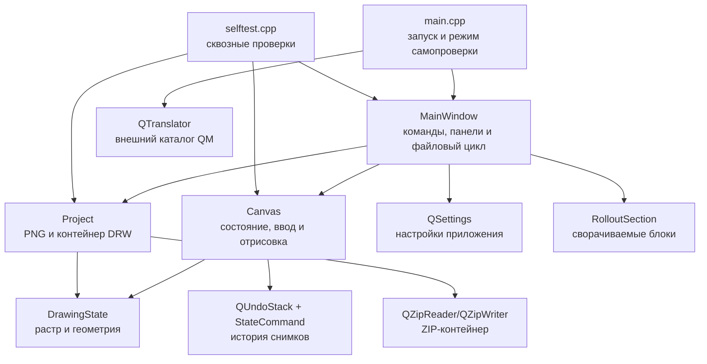

# Архитектура «Технический рисунок / Technical Draw»

## 1. Назначение и границы

Приложение — однодокументный растровый редактор на C++17 и Qt Widgets. Оно объединяет обычное рисование с неразрушающей оснасткой перспективы: горизонт, главная вертикаль, точки схода, семейства опорных линий, линейки и экранные маркеры не записываются в пиксели изображения.

Текущая архитектура рассчитана на один растровый слой. Камеры, трёхмерной сцены и физических параметров объектива в модели нет. Перспектива задаётся только геометрическими объектами на плоскости холста.

## 2. Компоненты

### `main.cpp`

Точка входа задаёт DPI-режим, технические идентификаторы приложения, шрифт, значок и мигрирует прежние настройки `DrawingPrototype/Drawing`. До создания окна она загружает через `QTranslator` внешний каталог из подкаталога `translations`: сначала для полной системной локали, затем для языка и, наконец, русский каталог по умолчанию. Обычный запуск создаёт `MainWindow`; параметр `--self-test <каталог>` передаёт управление встроенным проверкам без входа в основной цикл редактора. После показа окна `taskbarpin.cpp` проверяет одноразовый флаг установщика и через стабильный WinRT ABI вызывает системный `TaskbarManager`. Флаг снимается до вызова, поэтому отказ пользователя, политика или отсутствие API не создают повторных запросов.

### `MainWindow`

Главное окно отвечает за пользовательские команды и компоновку:

- создаёт меню, панели инструментов, строку состояния и dock-панель перспективы;
- размещает единое действие вспомогательного режима перспективы в главной верхней панели и меню, а в боковой панели оставляет рисующие инструменты и панорамирование;
- связывает элементы управления с методами `Canvas`;
- ведёт текущий путь документа, недавние файлы и каталоги открытия/сохранения;
- выполняет цикл «проверить несохранённые изменения → открыть/создать/закрыть»;
- вызывает `Project` для чтения, сохранения и экспорта;
- хранит настройки интерфейса и отображения в `QSettings`.

`MainWindow` не строит геометрию перспективы и не изменяет пиксели напрямую. Его поля элементов управления являются отражением текущего `DrawingState`; метод `updateState()` синхронизирует интерфейс после изменения модели или истории.

### `DrawingToolSettingsModel` и `ToolPropertiesPanel`

`DrawingToolSettingsModel` хранит независимые параметры карандаша, кисти и ластика в `QSettings`: ширину, непрозрачность, жёсткость, шаг отпечатков и силу. Активный инструмент выбирает один из трёх наборов, поэтому единая панель не создаёт дублирующих состояний. Прежние ключи ширины продолжают читаться и обновляться для совместимости.

`ToolPropertiesPanel` находится внутри левой панели инструментов под кнопками выбора. Часто используемые параметры и дополнительные свойства наконечника разнесены по двум сворачиваемым секциям. Панель получает только модель настроек и `DrawingTargetContext`; она не обращается к `QImage`. Сейчас контекст описывает единственный редактируемый растр без доступной прозрачности, а этап 8 будет формировать его из активного слоя. Поэтому ластик пока сообщает «Цветом Back», но интерфейс уже умеет показать «До прозрачности» или причину недоступности без замены панели.

### `Canvas`

`Canvas` — центральный интерактивный виджет и владелец активного `DrawingState`. Он:

- рисует изображение, оснастку перспективы, маркеры и четыре линейки;
- преобразует координаты изображения и окна;
- обрабатывает мышь, клавиши, масштаб и панорамирование;
- выполняет карандаш, кисть, ластик и связанные отрезки;
- выбирает, перемещает, фиксирует и привязывает точки и оси;
- применяет симметрию пар точек;
- хранит `QUndoStack` и формирует `DrawingHistory` для сохранения.

Изменение документа, которое должно участвовать в Undo/Redo, начинается с копии `DrawingState before` и завершается `commit()`. Изменения только внешнего вида оснастки обновляют состояние и виджет, но не обязаны попадать в проектную историю.

Растровый штрих строится одинаковым конвейером для трёх инструментов: `Canvas` интерполирует траекторию и через заданный процент диаметра накладывает круглый отпечаток. Остаток расстояния переносится между соседними событиями мыши, поэтому быстрый ввод не создаёт разрывов и не зависит от частоты событий. Карандаш использует жёсткий круг, кисть — круг с радиальным переходом жёсткости, ластик — тот же наконечник с операцией Back текущего однослойного документа. Один завершённый жест по-прежнему создаёт одну команду Undo.

### `StateCommand`

Закрытый класс в `canvas.cpp` реализует одну команду `QUndoCommand`. Он хранит состояния до и после операции и вызывает `Canvas::apply()` при отмене и повторе. Такая модель проста и надёжна для текущего ограничения размера холста; число снимков ограничивается по ориентировочному бюджету памяти и верхнему пределу истории.

### Модель проекта

`project.h` определяет три типа данных:

- `VanishingPoint` — устойчивый идентификатор, имя, координаты, набор привязок, фиксация и текущие параметры отображения точки;
- `DrawingState` — изображение, коллекция точек, положение и фиксация осей, а также параметры отображения оснастки;
- `DrawingHistory` — последовательность состояний, подписи переходов и текущая позиция Undo/Redo.

Пространство имён `PerspectiveTarget` централизует служебные идентификаторы привязок. Пространство имён `Project` задаёт версию формата и операции PNG/DRW.

### `Project`

`project.cpp` — единственная подсистема, знающая устройство `.drw`. Она проверяет размеры и ограничения, преобразует геометрию в JSON, кодирует растры в PNG, читает прежние версии и атомарно заменяет файл через `QSaveFile`.

ZIP реализован закрытыми классами Qt `QZipReader` и `QZipWriter`. Из-за этого бинарник привязан к точной сборке Qt 5.15.2; при обновлении Qt требуется отдельная проверка или замена ZIP-слоя публичной библиотекой.

### `RolloutSection`

Небольшой составной виджет формирует рамку, заголовок с треугольной кнопкой и скрываемую область содержимого. Он не знает о перспективе и может повторно использоваться для других сворачиваемых блоков интерфейса.

### `selftest.cpp`

Встроенный сквозной тест запускает настоящие `Canvas` и `MainWindow`, имитирует ввод, проверяет состояния, настройки и файлы, а также сохраняет эталонные снимки. Режим `offscreen` не проверяет системные диалоги; режим `windows` дополняет его оконными сценариями.

## 3. Поток изменения данных

Обычное действие проходит следующий путь:

1. `QAction`, элемент панели либо событие мыши получает пользовательский ввод.
2. `MainWindow` вызывает публичный метод `Canvas`, либо `Canvas` обрабатывает событие непосредственно.
3. `Canvas` проверяет ограничения, изменяет `DrawingState` и при документной операции добавляет `StateCommand` в `QUndoStack`.
4. `Canvas` испускает `stateChanged()`, `viewChanged()`, `positionChanged()` или `selectedPointChanged()`.
5. `MainWindow` обновляет доступность команд, значения контролов, заголовок и строку состояния.
6. `Canvas::paintEvent()` заново строит изображение и служебную оснастку.

При сохранении `MainWindow` получает `Canvas::history()` и передаёт её `Project::save()`. После успешной атомарной записи чистая позиция `QUndoStack` соответствует сохранённому состоянию. При открытии `Project::load()` возвращает историю, а `Canvas::setDocument()` восстанавливает команды и индекс.

## 4. Системы координат

### Координаты изображения

Внутри `QImage` начало находится в левом верхнем углу, X растёт вправо, Y — вниз. Положения точек и осей в `DrawingState` хранятся именно в этих пиксельных координатах и могут лежать за границами изображения.

### Пользовательские координаты

Числовые поля показывают значения относительно центра холста: X растёт вправо, Y — вверх. В процентном режиме `100%` равно полной ширине или высоте, поэтому правый верхний угол имеет `(50%, 50%)`. Единицы выбранной точки/оси не связаны с единицами линеек.

### Координаты виджета

`toView()` переносит точку изображения относительно его центра, умножает на `zoom_`, затем добавляет центр доступного viewport и `pan_`. `toImage()` выполняет обратное преобразование. Толщины маркеров, зоны попадания, отступ луча и длина нарастания прозрачности задаются в экранных пикселях и не меняются при масштабе.

Панорамирование изменяет только `pan_`; масштаб изменяет `zoom_` вокруг заданной экранной опорной точки. Ни одна из этих операций не меняет изображение или проектную геометрию.

Положение курсора показывается двумя штриховыми проекциями через всю область просмотра и все четыре линейки. Отдельные числовые плашки на линейках не строятся; координаты остаются в строке состояния и используют выбранные для линеек единицы.

## 5. Геометрия перспективы

Горизонт всегда задаётся одним `horizonY`, главная вертикаль — одним `verticalX`; наклона у осей нет. Точка может быть свободной, привязанной к одной оси или одновременно к обеим. Привязка хранится массивом устойчивых идентификаторов, а не номером точки.

При перетаскивании зона прилипания равна 10 экранным пикселям. В пересечении осей обе привязки могут действовать одновременно. Перемещение оси переносит соответствующую координату всех привязанных точек. Фиксация запрещает перетаскивание объекта мышью.

Симметрия горизонта связывает точки, прикреплённые только к горизонту, относительно главной вертикали. Симметрия главной вертикали аналогично связывает точки на вертикали относительно горизонта. Партнёр выбирается в начале перетаскивания как ближайшая точка к зеркальной позиции и сохраняется до отпускания кнопки.

Каждая видимая точка формирует собственный веер прямых. Угловой шаг ограничен диапазоном 1–30°. Рисуются только лучи, пересекающие холст: участок начинается после экранного отступа от точки и заканчивается после дальней границы изображения. Горизонт и главная вертикаль продолжаются через viewport.

## 6. Формат `.drw`

`.drw` — ZIP-контейнер. Текущая версия схемы — 8.

| Элемент | Назначение |
|---|---|
| `project.json` | Версия, размеры, геометрия перспективы, фиксация, подписи истории, индекс истории и ссылки на PNG-состояния. |
| `drawing.png` | Текущее растровое состояние; имя сохранено для совместимости. |
| `history/state-XXXX.png` | Уникальные растровые состояния Undo/Redo. Одинаковый растр не дублируется при чисто геометрических операциях. |

Сохраняются координаты, идентификаторы, названия, привязки и фиксация точек, а также положение и фиксация осей. Цвета, видимость, шаблоны лучей и другие параметры отображения берутся из настроек приложения и при чтении проекта не восстанавливаются.

Загрузчик принимает версии 1–8 и последовательно заполняет поля, отсутствовавшие в старых схемах. Неизвестная будущая версия отклоняется. Ограничения входа защищают от чрезмерных размеров изображения, распакованного архива, JSON и истории.

## 7. Настройки приложения

`QSettings` использует технические идентификаторы организации и приложения `TechDraw`. Основные группы:

- `files/*` — раздельные каталоги открытия/сохранения и пять недавних файлов;
- `canvas/*` — последний размер нового холста;
- `tools/*` — отдельная ширина карандаша, кисти и ластика;
- `view/rulers/*` — единицы линеек;
- `perspective/common/*` — сохранённый набор параметров лучей;
- `perspective/view/*` — цвета, толщины, видимость, симметрия и прочее оформление;
- `perspective/points/*` — значения отображения точек по порядку.
- `installer/pendingTaskbarPin` — одноразовое намерение запросить системное закрепление на панели задач.

Настройки интерфейса не являются частью `.drw`. При первом запуске с пустыми текущими настройками выполняется одноразовое копирование прежней группы `DrawingPrototype/Drawing`.

## 8. Сборка и поставка

Корневой `CMakeLists.txt` создаёт одну цель `TechDraw`, включает C++17, AUTOMOC/AUTORCC, Qt Widgets, Qt LinguistTools и закрытую цель Qt Gui. `qt5_add_translation` собирает `translations/techdraw_ru.ts` в `.qm`, а команда после сборки помещает каталог в `translations` рядом с EXE. Для MinGW Windows-ресурс компилируется отдельной командой, чтобы `windres` работал с путями, содержащими пробелы.

Сценарии `scripts/windows` составляют поддерживаемый интерфейс сборки. x64 и x86 используют отдельные комплекты Qt/MinGW, каталоги CMake, переносимые пакеты `dist/TechDraw` и `dist/TechDraw-x86`, результаты проверок и установщики с суффиксом архитектуры. Перед упаковкой PE-заголовки всех EXE/DLL проверяются на единую разрядность.

IExpress содержит `payload.zip`, `payload.json` и локализованный PowerShell-мастер. JSON задаёт версию, архитектуру и полный список принадлежащих пакету файлов. Установка сначала распаковывает staging-копию, сохраняет резервные копии заменяемых файлов и только после успешного копирования обновляет частный манифест. Repair и обновление заменяют весь принадлежащий комплект, а удаление следует манифесту и сохраняет посторонние файлы и пользовательские документы. Области CurrentUser и AllUsers имеют раздельные каталоги, ярлыки и ветви реестра. Заглушки подписи вызываются после развёртывания бинарных файлов и после создания итогового IExpress EXE. Подробные команды находятся в [howto.md](howto.md).

## 9. Точки расширения

### Новый рисующий инструмент

Добавьте значение в `Canvas::Tool`, действие меню/панели в `MainWindow`, обработку штриха в `Canvas` и сквозную проверку. Если инструмент имеет собственные постоянные параметры, храните их отдельно в `QSettings`. Пиксельные изменения должны проходить через `commit()`.

### Новый тип перспективы

Расширяйте геометрию модели независимо от `MainWindow`: новые устойчивые данные добавляются в `DrawingState`, их ввод и отрисовка — в `Canvas`, элементы управления — в панели окна. Изменение сохраняемого формата требует увеличить `Project::CurrentFormatVersion`, добавить обратное чтение и тесты старых версий.

Криволинейные направляющие должны появиться раньше инструментов рисования вдоль них. Внешний вид направляющих остаётся служебным оверлеем, пока пользователь явно не создаёт пиксельный штрих.

### Новый параметр интерфейса

Сначала определите владельца: данные конкретного рисунка относятся к `.drw`; предпочтения отображения и рабочего места — к `QSettings`. Не дублируйте одно значение в обоих хранилищах без правила разрешения конфликта.

### Новый формат экспорта

Экспорт получает только `DrawingState::image`. Оснастка не должна попадать в результат. Реализацию следует изолировать рядом с `Project::exportPng()` либо в отдельном модуле форматов, если вариантов станет несколько.

## 10. Инварианты сопровождения

- Пользовательское название — «Технический рисунок / Technical Draw»; `TechDraw` используется для бинарника и служебных идентификаторов.
- Каждая видимая пользователю строка проходит через `tr()` или `QCoreApplication::translate()`; каталог `.qm` остаётся внешним файлом поставки.
- Горизонт горизонтален, главная вертикаль вертикальна; камеры и наклона осей в модели нет.
- Служебная оснастка не изменяет пиксели и не попадает в PNG.
- Изменение формата `.drw` сопровождается новой версией, обратным чтением и тестами.
- Qt и MinGW должны происходить из одного совместимого комплекта.
- Изменения сборки, каталогов результатов, форматов и ответственности компонентов требуют синхронного обновления `howto.md` или этого документа согласно `AGENTS.md`.
